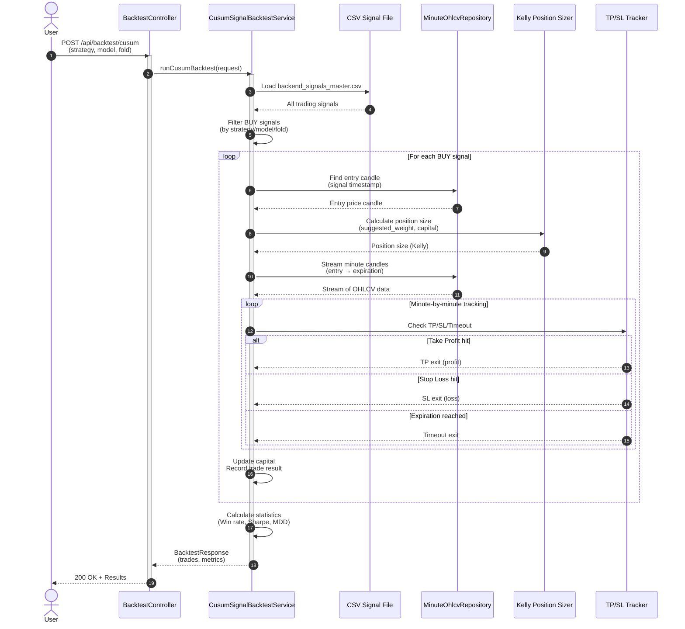
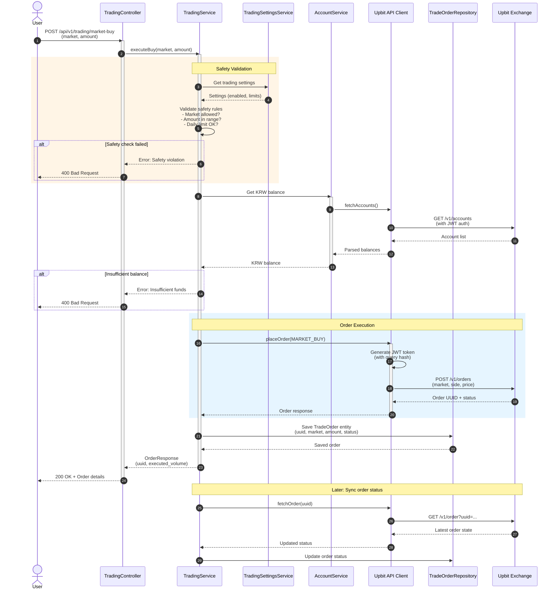
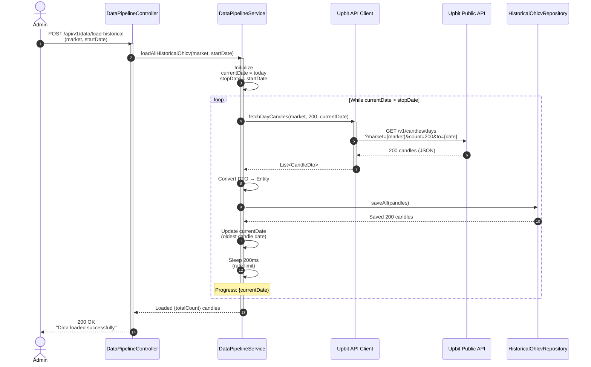
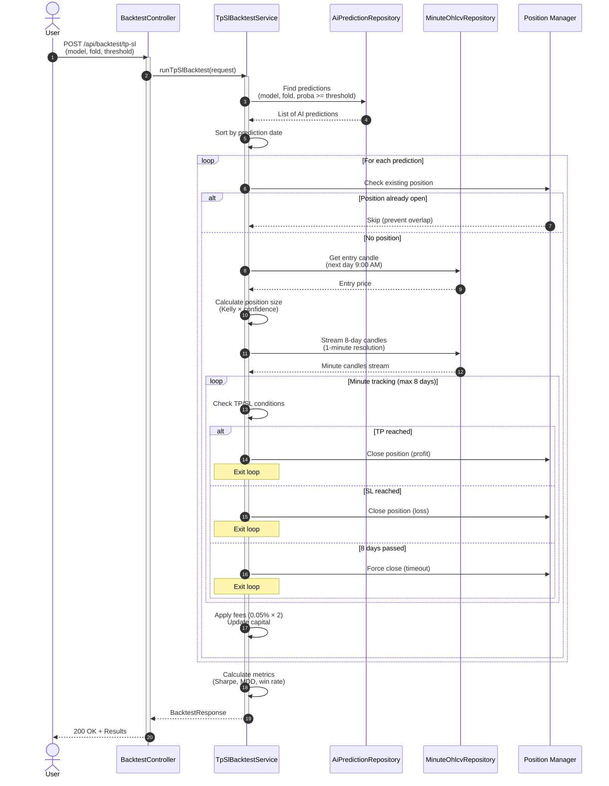
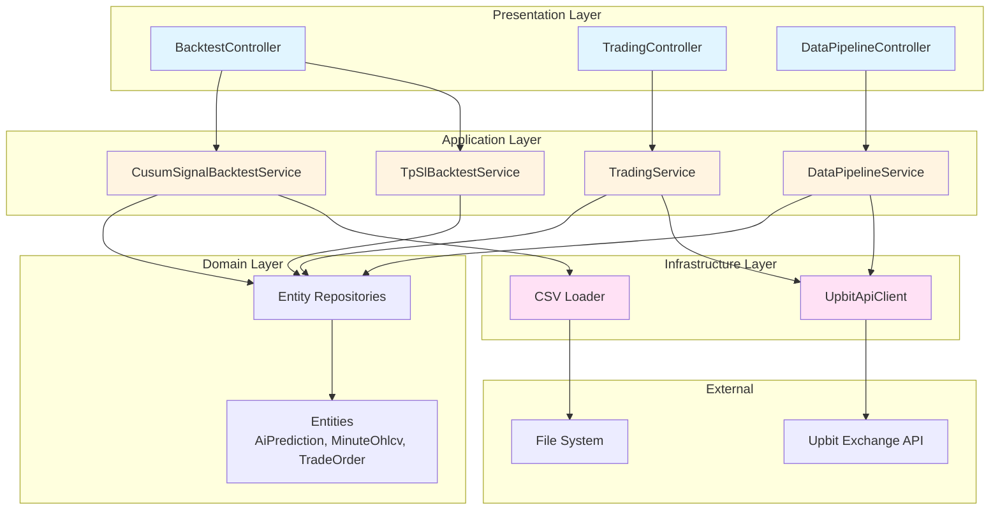

# System Sequence Diagrams

이 문서는 트레이딩 엔진의 주요 흐름을 시퀀스 다이어그램으로 표현합니다.

## 1. CUSUM Signal Backtesting Flow

AI가 생성한 매매 신호(CSV)를 기반으로 백테스팅을 수행하는 흐름입니다.

### 핵심 포인트
- **CSV 기반**: AI가 미리 생성한 신호 (entry time, TP/SL prices, confidence)
- **1분봉 정밀도**: Look-ahead bias 방지를 위한 분 단위 추적
- **Kelly Criterion**: 신뢰도 기반 포지션 사이징
- **승률 계산**: Timeout은 제외하고 TP/(TP+SL)로 계산

---

## 2. Real Trading Execution Flow

실제 Upbit 거래소에서 매매를 실행하는 흐름입니다.

### 핵심 포인트
- **다층 안전장치**: Settings validation → Balance check → Execution
- **인증**: JWT 토큰 기반 Upbit API 호출
- **추적성**: 모든 주문을 DB에 저장 및 동기화
- **비동기 동기화**: 주문 상태를 나중에 업데이트 가능

---

## 3. Historical Data Pipeline Flow

Upbit에서 과거 캔들 데이터를 수집하는 흐름입니다.

### 핵심 포인트
- **배치 수집**: 한 번에 200개 캔들씩 페이지네이션
- **역방향 수집**: 최신 → 과거 방향으로 수집
- **Rate Limiting**: API 호출 간 200ms 대기
- **동일 흐름**: 분봉(MinuteOhlcv)도 동일한 패턴

---

## 4. AI Model Backtesting Flow (TP/SL)

DB에 저장된 AI 예측을 기반으로 백테스팅하는 흐름입니다.

### 핵심 포인트
- **DB 기반**: HistoricalAiPrediction 테이블에서 예측 로드
- **포지션 중복 방지**: 기존 포지션 열려있으면 새 진입 스킵
- **8일 홀딩**: 최대 보유 기간 후 강제 청산
- **수수료 적용**: 진입/청산 각 0.05%

---

## Architecture Overview

---

## 주요 설계 특징

### 1. **Hexagonal Architecture (Ports & Adapters)**
- **Domain**: 비즈니스 로직 (포지션 사이징, 위험 계산)
- **Inbound Adapters**: REST Controllers
- **Outbound Adapters**: Upbit API, JPA Repositories
- **Application Services**: 오케스트레이션 레이어

### 2. **백테스팅 정밀도**
- 1분봉 사용으로 Look-ahead bias 방지
- TP/SL 동시 도달 시 캔들 방향성으로 판단 (open vs close)
- 수수료 반영 (0.05% 양방향)

### 3. **안전 장치**
- 다층 검증 (TradingSettings → Balance → Execution)
- 일일 거래 횟수 제한
- 최소/최대 거래 금액 설정
- 허용 마켓 화이트리스트

### 4. **데이터 파이프라인**
- Pagination (200개씩)
- Rate limiting (200ms 대기)
- 역방향 수집 (최신 → 과거)
- 스트림 기반 메모리 효율성

### 5. **Kelly Criterion 포지션 사이징**
- Conservative Kelly
- Estimation Risk Kelly
- Half/Quarter Kelly
- Confidence-weighted variants

---

## 기술 스택

- **Framework**: Spring Boot 3.x
- **Database**: PostgreSQL (JPA/Hibernate)
- **HTTP Client**: WebClient (Reactive)
- **Authentication**: JWT (Upbit API)
- **Data Processing**: Stream API
- **Backtesting**: Custom engine (minute-level precision)
