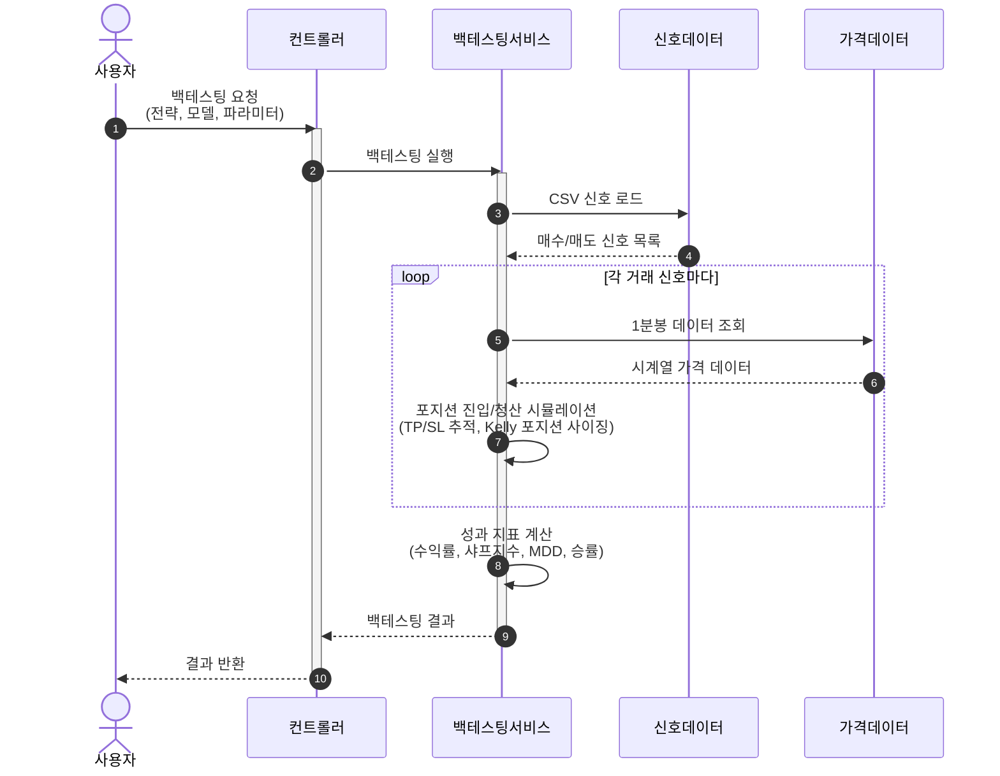
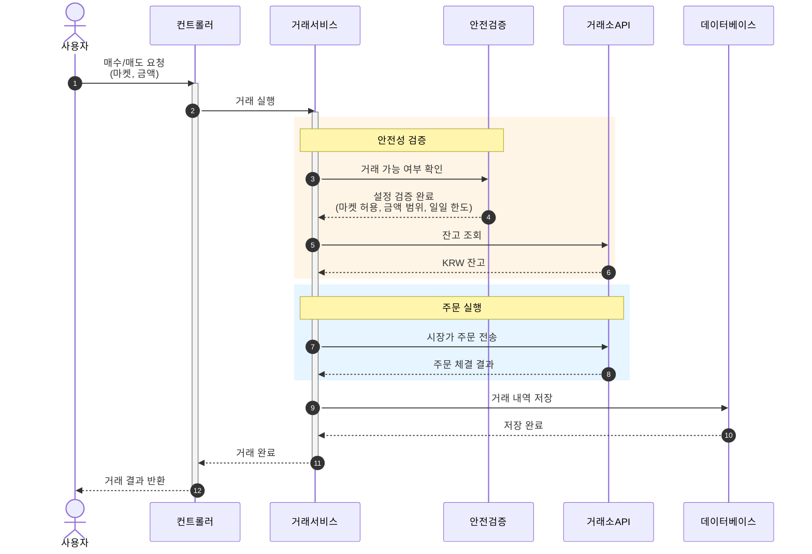
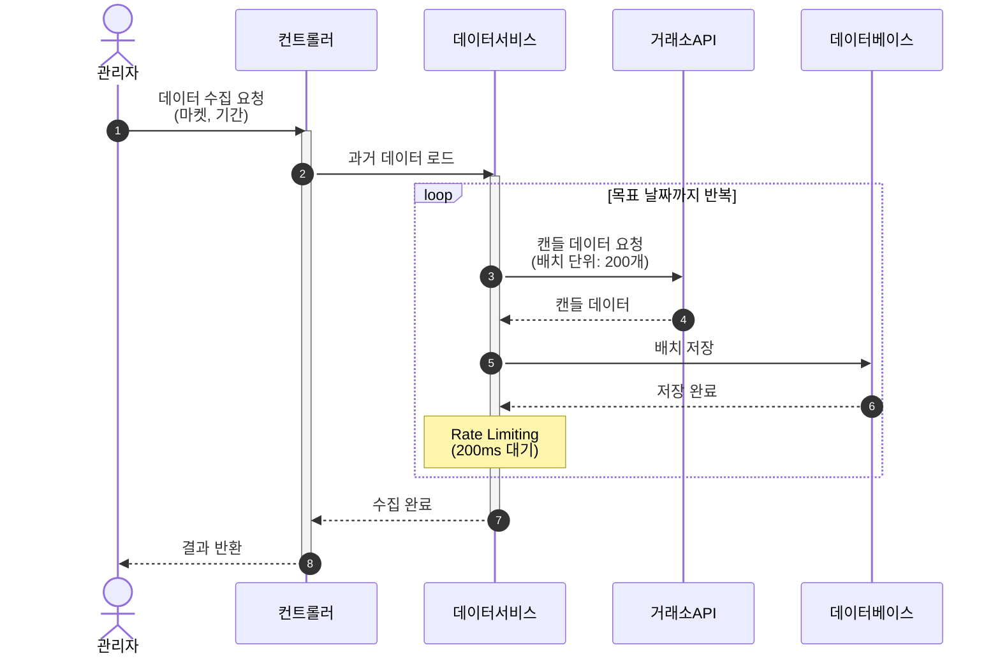
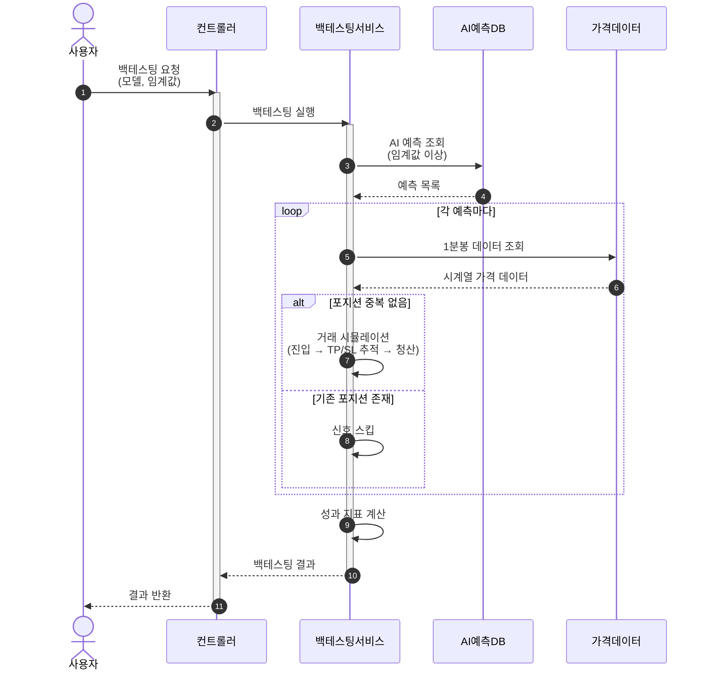
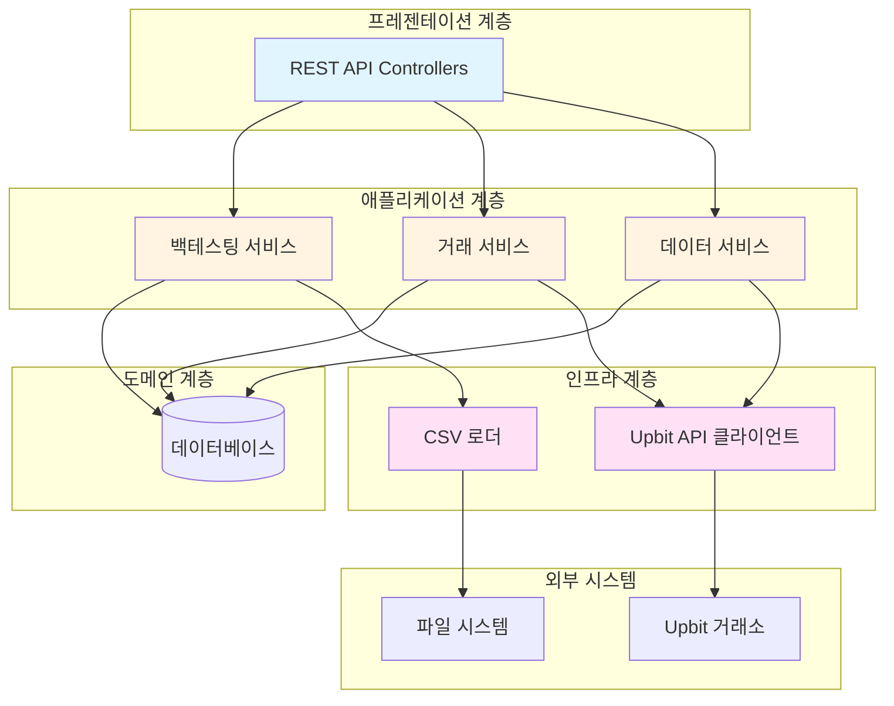

# 트레이딩 엔진 시퀀스 다이어그램

암호화폐 트레이딩 엔진의 핵심 흐름을 시퀀스 다이어그램으로 표현합니다.

---

## 1. CUSUM 신호 백테스팅

AI가 생성한 CSV 신호를 기반으로 과거 데이터에서 백테스팅을 수행합니다.

### 핵심 특징
- **AI 신호 기반**: CSV 파일에 저장된 AI 예측 신호 활용
- **1분봉 정밀 추적**: 분 단위로 TP/SL 도달 여부 확인
- **Kelly Criterion**: 신뢰도 기반 포지션 크기 결정

---

## 2. 실시간 거래 실행

Upbit 거래소에서 실제 매매를 실행합니다.

### 핵심 특징
- **다층 안전장치**: 설정 검증 → 잔고 확인 → 주문 실행
- **거래 추적**: 모든 주문 내역을 DB에 저장
- **실시간 동기화**: 주문 상태를 주기적으로 업데이트

---

## 3. 과거 데이터 수집

Upbit에서 과거 캔들 데이터를 수집하여 저장합니다.

### 핵심 특징
- **배치 처리**: 200개씩 페이지네이션으로 수집
- **Rate Limiting**: API 호출 간격 제어
- **역방향 수집**: 최신 데이터부터 과거로 수집

---

## 4. AI 모델 백테스팅

데이터베이스에 저장된 AI 예측을 기반으로 백테스팅을 수행합니다.

### 핵심 특징
- **DB 기반 예측**: 미리 저장된 AI 예측 활용
- **포지션 관리**: 중복 포지션 방지
- **홀딩 기간 제한**: 최대 8일 보유 후 강제 청산

---

## 시스템 아키텍처

---

## 주요 설계 원칙

### 1️⃣ 헥사고날 아키텍처
- **도메인 중심**: 비즈니스 로직이 핵심
- **포트와 어댑터**: 외부 시스템과의 결합도 최소화
- **테스트 용이성**: 각 계층 독립적으로 테스트 가능

### 2️⃣ 백테스팅 정밀도
- **1분봉 활용**: 실제 거래와 유사한 시뮬레이션
- **Look-ahead Bias 방지**: 미래 정보 사용 금지
- **수수료 반영**: 실제 거래 비용 고려

### 3️⃣ 안전성 우선
- **다층 검증**: 설정 → 잔고 → 실행 순차 확인
- **거래 제한**: 일일 한도, 금액 범위 설정
- **추적 가능성**: 모든 거래 기록 저장

### 4️⃣ 확장성
- **비동기 처리**: 대용량 백테스팅 지원
- **배치 처리**: 효율적인 데이터 수집
- **스트림 처리**: 메모리 효율적인 데이터 처리

---

## 기술 스택

| 계층 | 기술 |
|------|------|
| **프레임워크** | Spring Boot 3.x |
| **데이터베이스** | PostgreSQL |
| **HTTP 클라이언트** | WebClient (Reactive) |
| **인증** | JWT (Upbit API) |
| **데이터 처리** | Java Stream API |
| **백테스팅** | Custom Engine |
